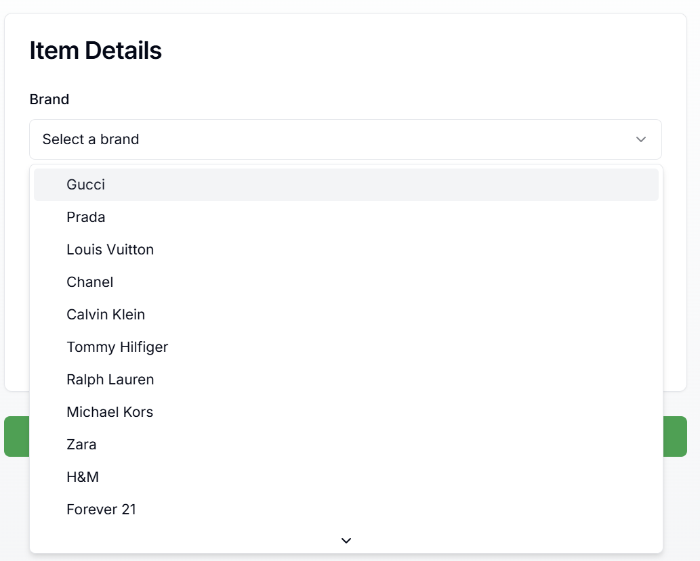
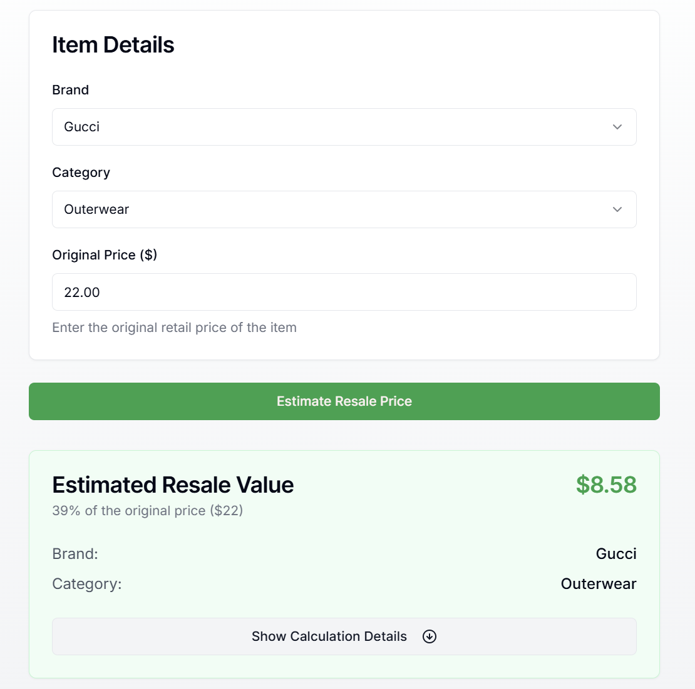
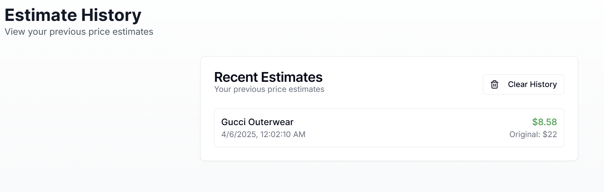

# Cache Resale Price Estimator

A full-stack application that estimates the resale price of clothing items based on brand, category, and original price. This project demonstrates a simple resale pricing workflow with a backend API and a frontend interface.

---

## Features
- **Backend API**: Calculates resale price based on brand, category, and original price using predefined logic.
- **Frontend Interface**: A clean and responsive form for submitting clothing details and displaying the estimated resale price.
- **History Tracking**: Stores and displays previous estimates using local storage.
- **Error Handling**: Graceful handling of invalid inputs and server errors.
- **Dark Mode Support**: Fully styled with Tailwind CSS, including dark mode compatibility.

---

## Technologies Used
- **Backend**: Node.js, Express.js
- **Frontend**: React (Next.js)
- **Styling**: Tailwind CSS, Radix UI
- **State Management**: React Hooks
- **Environment Management**: dotenv
- **Deployment**: Backend on Heroku, Frontend on Vercel

---

## Setup Instructions

### Prerequisites
- **Node.js**: Ensure you have Node.js (v18 or later) installed.
- **npm**: Comes with Node.js.
- **Git**: For cloning the repository.

---

### Backend Setup
1. Navigate to the `backend` folder:
   ```bash
   cd backend
   ```

2. Install dependencies:
   ```bash
   npm install
   ```

3. Create a `.env` file in the `backend` folder and add the following:
   ```plaintext
   PORT=5000
   ```

4. Start the backend server:
   ```bash
   node index.js
   ```

5. The backend will run at `http://localhost:5000`.

---

### Frontend Setup
1. Navigate to the `frontend` folder:
   ```bash
   cd frontend
   ```

2. Install dependencies:
   ```bash
   npm install
   ```

3. Start the React development server:
   ```bash
   npm run dev
   ```

4. The frontend will run at `http://localhost:3000`.

---
## Approach

### Backend
- The backend is built using **Node.js** and **Express.js**.
- It uses a predefined `model.json` file to calculate resale prices based on brand and category factors.
- The logic dynamically loads the model, making it easy to update without modifying the backend code.
- Error handling ensures invalid inputs are gracefully managed.

### Frontend
- The frontend is built with **React (Next.js)** for a modern, responsive user interface.
- It includes a form for submitting clothing details and displays the estimated resale price.
- Local storage is used to persist and display a history of previous estimates.
- Tailwind CSS and Radix UI are used for styling, with full dark mode support.

---

## Screenshots
### 1. **Frontend Form**


### 2. **Estimate Results**


### 3. **History List**


---

## Demo Video

[](https://youtu.be/DjN2feHpBRQ)

---

## License
This project is licensed under the MIT License. See the `LICENSE` file for details.
